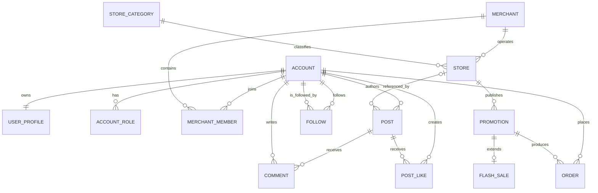

# CampusHub 领域模型

## 1 文档目的与阶段结论

本文定义 CampusHub 从点评教学项目演进为校园生活与商户服务平台时采用的统一业务语言、实体关系、核心规则、权限边界和旧数据映射。它是 Phase 1A 的设计结论，不在本阶段修改 Java 类、数据库表、接口或运行行为。

CampusHub 继续采用模块化单体。第一版按单校园场景设计，不引入多租户或 `Campus` 表；当系统出现跨校数据隔离、不同校区运营或独立管理员等真实需求时，再增加校园维度。当前重点是把“账号、商户主体、门店、内容、活动和订单”分清，而不是机械替换 `Shop`、`Blog`、`Voucher` 等名称。

关键决策：

1. `User` 是登录账号；普通学生、商户操作员和管理员共用账号体系，一个账号可以拥有多个角色。
2. `Merchant` 是经营主体，不是登录账号，也不等同于门店；商户操作员通过成员关系管理其所属商户和门店。
3. 当前 `Shop` 的业务含义是 `Store`。迁移初期保留 `tb_shop` 和旧类名，避免把领域改名与正确性修复混在一起。
4. 当前 `Blog` 演进为 `Post`。动态由用户发布，可以关联门店；普通校园动态未来允许不关联门店。
5. 当前 `Voucher` 演进为 `Promotion`，`SeckillVoucher` 是限量活动 `FlashSale` 的扩展，订单只引用活动标识。
6. MySQL 保存业务事实；Redis 中的 Feed、点赞排行、GEO、签到位图和活动预扣是索引、投影或运行态，不能被描述为全部业务事实的唯一来源。

## 2 统一领域词汇

| 领域对象 | 含义 | 当前映射 | 本阶段处理 |
| --- | --- | --- | --- |
| Account | 可登录账号及账号状态 | `User` 的认证字段、`tb_user` | 保留旧名，后续补状态与角色 |
| UserProfile | 昵称、头像、个人资料与活跃信息 | `User` 的展示字段、`UserInfo`、`tb_user_info` | 保留；修正错误字段类型时使用迁移脚本 |
| Role | `USER`、`MERCHANT`、`ADMIN` 权限集合 | 不存在 | Phase 2 增加，不塞入现有布尔字段 |
| Merchant | 校园周边经营主体 | 不存在 | 商户后台落地前增加 |
| MerchantMember | 账号与商户的成员及管理关系 | 不存在 | 与 Merchant 同阶段增加 |
| Store | 用户可浏览、搜索和到店消费的门店 | `Shop`、`tb_shop` | 先保持表和接口兼容，Phase 1C 再迁移代码身份 |
| StoreCategory | 门店分类 | `ShopType`、`tb_shop_type` | 保留语义，后续改名 |
| Post | 校园动态或与门店关联的内容 | `Blog`、`tb_blog` | 先修 Feed，再迁移名称与请求响应边界 |
| Comment | 对动态的评论或回复 | `BlogComments`、`tb_blog_comments` | 当前只有空接口，后续实现 |
| Follow | 用户对用户的关注关系 | `Follow`、`tb_follow` | MySQL 为事实来源，Redis 仅加速 |
| PostLike | 用户对动态的点赞关系 | Redis ZSet 和 `tb_blog.liked` 计数 | 后续增加持久化关系，计数作为派生值 |
| FeedEntry | 用户 Feed 收件箱中的动态投影 | Redis ZSet | 不是独立业务事实，可由关注与动态重建 |
| Promotion | 门店发布的优惠或活动规则 | `Voucher`、`tb_voucher` | 先保留表结构，后续明确状态机 |
| FlashSale | Promotion 的限时限量规则 | `SeckillVoucher`、`tb_seckill_voucher` | 保留一对一扩展方式 |
| Order | 用户参与活动后的订单结果 | `VoucherOrder`、`tb_voucher_order` | 补幂等、状态与恢复能力后再扩展 |
| CheckIn | 用户每日签到行为 | Redis Bitmap；`tb_sign` 未被代码使用 | 第一版继续用 Bitmap，明确其数据保留策略后再决定是否落库 |
| Notification | 面向用户或商户的通知 | 不存在 | 仅保留模块边界，有明确通知场景后建模 |

`UserInfo.level` 在 Java 中是 `Boolean`，数据库注释却表示 0 到 9 的等级；`BlogComments.status` 也用 `Boolean` 承载三种状态。这两处属于旧模型错误，不能沿用为新领域定义。

## 3 核心实体与关系

### 3.1 身份与账号

`Account` 负责认证标识、凭据、状态和角色，不承载商户资料。默认注册账号拥有 `USER` 角色；成为商户操作员需要平台审核后的有效 `MerchantMember`，同时拥有 `MERCHANT` 角色。管理员角色不能通过普通注册或公开接口自行获得。

账号状态至少区分 `ACTIVE` 和 `DISABLED`。禁用账号不能继续创建会话或执行受保护操作，已有会话需要能够失效。角色用于粗粒度准入，资源归属用于细粒度授权，两者缺一不可。

`UserProfile` 与 Account 一对一。昵称、头像、介绍、生日等属于资料；关注数、粉丝数、积分和等级是派生或活跃体系数据，不应参与认证决策。

### 3.2 商户与门店

`Merchant` 表示经营主体，`Store` 表示具体经营地点。一个 Merchant 可以经营多个 Store，一个 Store 在完成迁移后必须归属于一个 Merchant。商户成员关系至少包含 `OWNER` 和 `OPERATOR` 两种成员角色，以及有效状态。

迁移前的 `tb_shop` 没有所有者。历史门店先标记为平台托管，完成商户认领或管理员分配后再建立归属；不能根据发布过某条动态或创建过某张优惠券来推断所有权。

Store 保存名称、分类、图片、地址、坐标、营业时间和展示统计。评分、销量和评论数属于可重算的展示数据，不作为授权或交易判断依据。

### 3.3 内容与社交

`Post` 必须有作者。用户动态可以不关联门店；探店内容和商户内容可以关联一个 Store。迁移当前 `tb_blog.shop_id NOT NULL` 前，旧接口仍要求门店标识；放宽为空必须通过版本化数据库迁移和兼容代码完成。

第一版把校园动态和门店体验统一为 Post，通过是否关联 Store 和内容类型区分，不立即增加独立 Review 聚合。当前没有结构化星级评价、消费凭证或“一次订单一次评价”的实现；若这些规则成为真实需求，再从 Post 中拆出 Review，不能仅凭 `tb_shop.score` 宣称已经具备评价系统。

`Comment` 属于一个 Post 并由一个账号创建。一级评论没有父评论；回复必须引用同一 Post 下存在且可见的评论。评论状态采用枚举语义，例如 `NORMAL`、`REPORTED`、`HIDDEN`，不能继续用 Boolean 表达三种状态。

`Follow` 只表示账号关注账号，禁止自己关注自己；同一 `(follower_id, followee_id)` 只能存在一次。MySQL 保存关系事实，Redis 集合或有序集合只能作为查询加速，结构必须统一。

`PostLike` 规定同一账号对同一 Post 最多存在一条有效点赞关系。`liked` 计数是派生值，不能在关系丢失时仍被视为可靠事实。Redis ZSet 可以保留点赞时间排序，但后续需要持久化关系或明确可恢复的数据策略。

`FeedEntry` 是面向某个账号的收件箱投影。Post 是内容事实，Follow 是订阅事实；Feed 丢失时应能够重建，因此 Feed 不拥有 Post 生命周期。

### 3.4 优惠活动与订单

`Promotion` 归属于 Store，描述标题、规则、金额、类型和发布状态。当前金额继续使用分为单位的整数。活动状态至少区分草稿、有效、下架和过期；过期由时间和状态共同判断，不能只依赖展示字段。

`FlashSale` 与 Promotion 一对一，只保存限时限量规则，例如库存、开始时间、结束时间和资格策略。必须满足开始时间早于结束时间、库存不为负、活动有效期与 Redis key TTL 一致等规则。

`Order` 关联 Account 和 Promotion。当前迁移范围继续采用“一名用户对同一活动最多一单”的规则，并由数据库 `(user_id, voucher_id)` 唯一约束提供最终防线。若未来业务允许多次购买，必须显式引入购买上限或批次模型，不能直接删除唯一约束。

Redis Lua 的成功仅表示请求被受理和库存已预扣，不等于数据库订单已经创建。订单必须能区分受理、创建、支付、核销、取消和退款等状态；当前代码只实际覆盖异步建单的一部分，不把既有状态字段当作完整业务闭环。

### 3.5 签到与通知

第一版签到仍使用按账号和月份分桶的 Redis Bitmap，规则是每个自然日最多签到一次，并能计算截至当天的连续签到天数。是否需要长期审计、补签和积分结算尚未形成真实用例，因此暂不让未使用的 `tb_sign` 成为事实来源。

Notification 只定义为未来独立模块。只有在订单状态、活动结果或商户审核等具体通知用例确定后，才设计通知实体、渠道、已读状态和重试策略；本阶段不为“看起来完整”而创建空表。

## 4 角色与资源权限

| 操作 | 匿名用户 | USER | MERCHANT | ADMIN |
| --- | --- | --- | --- | --- |
| 浏览已发布门店、动态和活动 | 允许 | 允许 | 允许 | 允许 |
| 管理本人资料和会话 | 不允许 | 仅本人 | 仅本人 | 仅本人 |
| 发布普通校园动态、评论、关注和点赞 | 不允许 | 允许 | 允许 | 允许 |
| 修改或删除动态、评论 | 不允许 | 仅本人 | 仅本人或所属商户内容 | 可按审核规则处理 |
| 签到、参与活动、查看订单 | 不允许 | 仅本人 | 以用户身份仅本人 | 仅管理接口，不能冒充用户下单 |
| 创建或修改门店 | 不允许 | 不允许 | 仅有效成员所属 Merchant 的 Store | 允许审核和平台管理 |
| 创建、上下架活动 | 不允许 | 不允许 | 仅所属 Store | 允许审核和平台管理 |
| 查看商户后台数据 | 不允许 | 不允许 | 仅所属 Merchant 或 Store | 允许平台范围查看 |
| 管理角色、账号状态和商户审核 | 不允许 | 不允许 | 不允许 | 允许 |

权限判断遵循以下顺序：

1. 验证会话有效且账号状态允许操作。
2. 验证账号拥有接口要求的角色。
3. 对资源写操作验证作者、MerchantMember 或 Store 归属。
4. 验证资源当前状态允许该动作，例如已过期活动不能重新抢购。
5. 在应用服务中执行用例，不能只依赖前端隐藏按钮或 Controller 路径配置。

`MERCHANT` 角色只代表账号可以进入商户能力，不代表可以修改全部 Store。`ADMIN` 也应通过独立管理用例操作，不直接复用普通用户接口绕过状态机和审计。

## 5 模块边界与依赖

| 模块 | 负责内容 | 可以依赖 |
| --- | --- | --- |
| identity | Account、UserProfile、Role、会话和账号状态 | shared |
| merchant | Merchant、MerchantMember、Store、StoreCategory 和资源归属 | identity、shared |
| content | Post、Comment、PostLike 和内容审核状态 | identity、merchant 的只读引用、shared |
| social | Follow、FeedEntry 和 Feed 重建 | identity、content 的标识或事件、shared |
| promotion | Promotion、FlashSale、资格和 Redis 活动态 | identity、merchant、shared |
| order | Order、幂等、消费、核销和补偿 | identity、promotion、shared |
| engagement | CheckIn、积分规则和活跃记录 | identity、shared |
| notification | 明确用例后的站内通知及投递状态 | 只消费其他模块公开事件或查询接口 |
| shared | API 错误、日志、配置和通用基础设施 | 不依赖业务模块 |

模块化单体内部优先使用明确的应用服务和标识引用。不得让 Controller 直接调用其他模块的 Mapper，也不得通过互相注入通用 MyBatis-Plus Service 形成循环依赖。只有确实需要异步处理或故障隔离时才使用事件。

## 6 旧模型兼容与迁移顺序

### 6.1 保留兼容

- Phase 1B 修复正确性时继续使用 `com.hmdp`、旧 Entity 和旧表名，避免业务修复与大规模重命名互相干扰。
- `tb_shop` 暂时承载 Store，`tb_blog` 暂时承载 Post，`tb_voucher` 暂时承载 Promotion。
- Redis key 和接口路径在替代实现完成验证前保持兼容；迁移时要有读写过渡或明确版本边界。
- 新增数据库约束和字段必须使用可重复执行、可审查的版本化迁移脚本，不能继续只编辑全量 `hmdp.sql`。

### 6.2 后续落地顺序

1. Phase 1B 先修 Feed key、关注 Redis 类型、缓存重建和订单 ACK，并增加关注及订单业务唯一约束。
2. Phase 1C 迁移应用身份、Maven 坐标和根包；不在同一提交创建商户后台。
3. Phase 2 增加账号状态和角色模型，再建立 Merchant、MerchantMember 与 Store 归属，完成历史门店的平台托管和认领迁移。
4. 内容模块实现时放宽普通 Post 的门店关联，并补 Comment 与 PostLike 的事实模型。
5. Phase 3 在 Promotion、FlashSale 和 Order 语义上完善活动时间、资格、可靠消费、补偿和状态查询。

## 7 本阶段不做事项

- 不修改 Java 包名、类名、接口路径或数据库表名。
- 不添加角色、商户、点赞或通知表。
- 不实现 Spring Security、商户后台或管理后台。
- 不选择 RabbitMQ、RocketMQ、Elasticsearch 或微服务架构。
- 不把尚未实现的支付、核销、补偿、通知和多校园能力写成现有功能。
- 不声明任何未经实际压测的 QPS、延迟、并发量或提升比例。

## 8 可验证的阶段出口

- 核心词汇能够映射到现有 Java Entity、数据库表或明确标记为缺失的新概念。
- Merchant 与 Store、Role 与资源归属、Promotion 与 FlashSale 的边界明确。
- USER、MERCHANT、ADMIN 的权限不仅按角色，还包含本人、作者、商户成员和门店归属约束。
- Follow、Feed、点赞、签到和 Redis 活动态明确区分业务事实与查询投影。
- 后续阶段可以按兼容顺序落地，不需要一次性重写现有系统。
