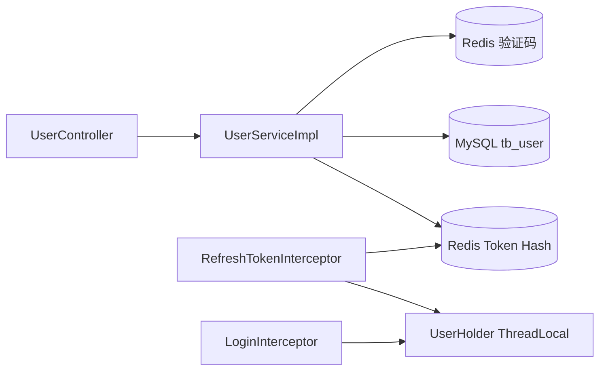
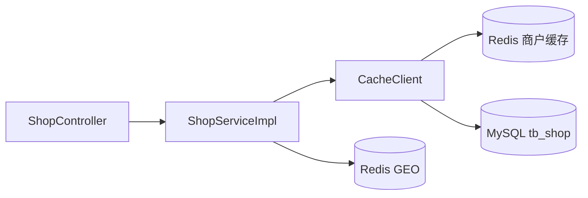
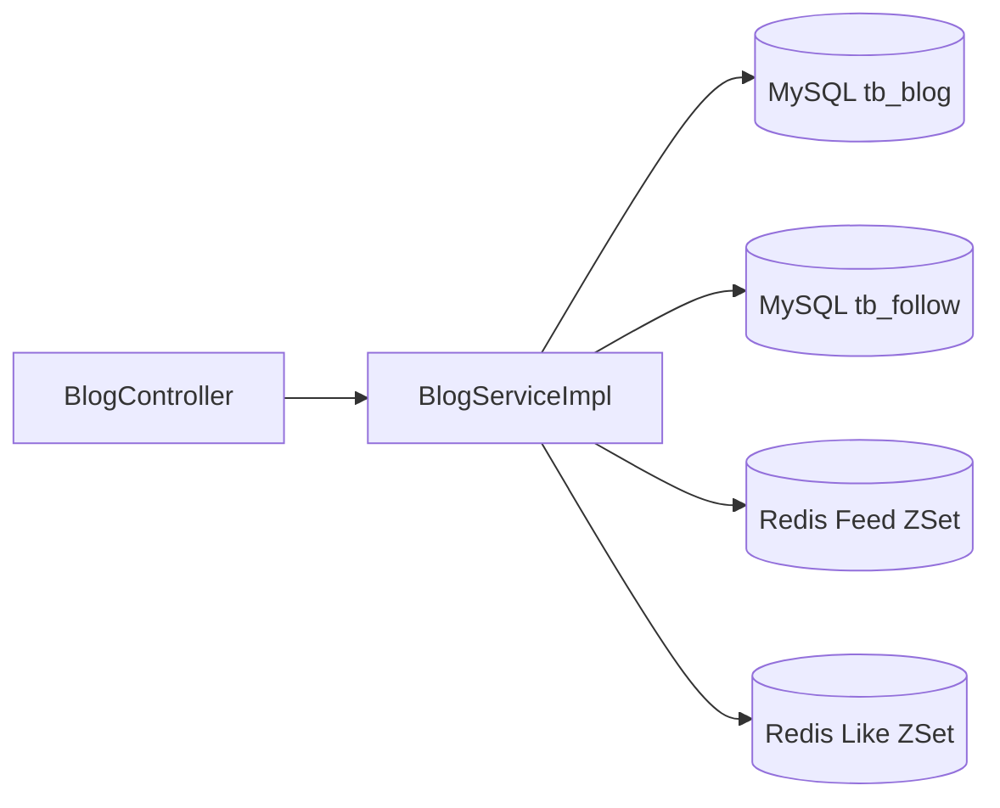
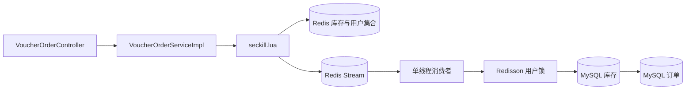

# CampusHub 当前状态审计

## 1 审计范围与结论

本次审计基于 `main` 分支提交 `e182f47`，覆盖全部 Java 源码、Lua 脚本、MyBatis Mapper、数据库初始化脚本、Maven 配置和现有测试。审计只新增文档，没有修改核心业务。

总体结论：仓库已经完成“干净历史 + 凭据外置”的最小迁移，但初始化代码仍是黑马点评教学项目的直接快照，尚不满足可复现、可维护、可安全运行的 CampusHub 基线。现有 Redis、Lua、Feed、GEO 和异步下单代码具有保留价值，但多个实现存在确定性缺陷，不能直接作为已完成的工程亮点。

本文使用以下证据标签：

- **事实**：可以从当前代码、SQL 或本次命令输出直接确认。
- **推断**：基于代码行为得出的工程判断，仍需运行场景验证。
- **未验证**：当前缺少依赖环境、测试或数据，不能宣称成立。

## 2 初始化仓库规范性检查

### 2.1 已符合的部分

- **事实**：远程仓库使用独立的单条初始提交，没有携带旧仓库 35 条教学提交历史。
- **事实**：数据库和 Redis 连接参数已经改为环境变量占位符，当前可达历史中没有迁移前的硬编码密码。
- **事实**：`.gitignore` 已覆盖 `target/`、IDE 配置和常见构建目录。
- **事实**：项目采用标准 Maven 单模块目录结构，源码和资源文件位置规范。

### 2.2 不符合或不完整的部分

- **事实**：Maven 坐标、应用名、启动类和根包仍为 `hm-dianping` / `com.hmdp`，项目描述仍是 `Demo project for Spring Boot`。
- **事实**：仓库没有 README、Maven Wrapper、环境变量示例、分环境配置、CI、许可证说明和贡献说明。
- **事实**：图片上传目录硬编码为 Windows 的黑马点评 Nginx 路径，macOS/Linux 无法直接使用。
- **事实**：数据库脚本包含旧点评业务命名、杭州商户样例和大量顺序手机号数据；虽然已确认允许公开，但来源与使用目的尚未在仓库中说明。
- **事实**：项目声明 Java 8 / Spring Boot 2.7.18；用本机 Maven 默认的 JDK 23 编译时，旧 Lombok 注解处理失败。
- **事实**：切换到 Corretto 8 后主代码可以编译并启动 Spring 测试上下文，但现有测试依赖真实 MySQL、Redis 和预先创建的 Redis Stream 消费组，不能开箱即测。

初始化规范结论：**可以作为遗留系统迁移起点，但不能作为 CampusHub 的稳定开发基线。**

## 3 当前架构

### 3.1 技术与模块

- Java 8、Spring Boot 2.7.18、Spring MVC
- MyBatis-Plus 3.4.3、MySQL 8 驱动
- Spring Data Redis、Lettuce、Redisson 3.16.6
- Hutool、Lombok
- Redis Lua、Redis Stream、Bitmap、GEO、ZSet、HyperLogLog 示例
- JUnit 5 / Spring Boot Test，但没有隔离的测试环境

当前是单体、单 Maven 模块、按技术层分包的结构：

```text
com.hmdp
├── controller    HTTP 接口
├── service       业务接口
├── service.impl  业务实现和部分基础设施逻辑
├── mapper        MyBatis-Plus 数据访问
├── entity        数据库实体，也被部分接口直接使用
├── dto           登录、用户、滚动分页和统一响应
├── config        MVC、MyBatis、Redisson、异常处理
└── utils         Redis key、缓存、锁、用户上下文等
```

### 3.2 数据模型

当前 SQL 包含 11 张表：

- `tb_user`、`tb_user_info`
- `tb_shop`、`tb_shop_type`
- `tb_blog`、`tb_blog_comments`
- `tb_follow`
- `tb_voucher`、`tb_seckill_voucher`、`tb_voucher_order`
- `tb_sign` 也存在于脚本中，但实际签到使用 Redis Bitmap，Java 代码没有访问该表

关系主要靠业务代码维护。除主键、用户手机号唯一索引和商户类型普通索引外，没有外键；`tb_follow` 和 `tb_voucher_order` 均缺少业务唯一约束。

## 4 主要调用链

### 4.1 验证码登录



事实：当前并非 JWT，而是随机 token + Redis Hash + 滑动过期。登录不存在角色、账号状态、登出和 token 主动失效体系。

### 4.2 商户查询与缓存



事实：代码保留了空值缓存、互斥锁和逻辑过期三套教学示例，当前商户详情实际选择逻辑过期方案。

### 4.3 动态发布与 Feed



事实：发布动态时查询粉丝并做写扩散；查询关注流使用 ZSet 时间戳游标分页。

### 4.4 限量活动下单



事实：Lua 原子执行库存检查、重复购买检查、预扣库存和写入 Stream；消费者再执行数据库库存扣减与建单。

### 4.5 其他能力

- 签到：Redis Bitmap 记录月度签到，并通过 BitField 计算连续签到天数。
- 附近商户：Redis GEO 按 5km 距离查询并回表保持顺序。
- 关注：MySQL 保存关系，Redis 保存关注集合用于共同关注。
- 点赞：MySQL 维护计数，Redis ZSet 维护点赞用户和时间顺序。

## 5 教学项目痕迹与保留建议

| 现状 | 判断 | 处理建议 |
| --- | --- | --- |
| `com.hmdp`、`HmDianPingApplication`、`Shop`、`Blog` 等命名 | 教程来源明显 | 分阶段迁移，不做一次性全局替换 |
| `@author 虎哥`、大量逐行教学注释和注释掉的旧实现 | 教学痕迹明显 | 代码稳定后逐步删除冗余注释，保留解释设计意图的注释 |
| 一个 Service 同时演示多种缓存方案 | 为教学展示而存在 | 选定一种生产路径，其余迁入学习文档或测试样例 |
| Redis Lua 原子校验 | 设计合理 | 建议保留并补活动时间、TTL、失败补偿与测试 |
| Redis Stream 异步下单 | 有学习和业务价值 | 先修可靠性；是否迁移专业 MQ 留到 Phase 3 决策 |
| Redisson 用户维度锁 | 可作为并发防线 | 建议保留，但数据库唯一约束必须作为最终防线 |
| ZSet Feed 游标分页 | 设计合理 | 修复写入 key 后保留，并增加测试 |
| Redis GEO | 与校园周边商户场景匹配 | 建议保留，补初始化和同步机制 |
| Bitmap 签到 | 与活跃体系匹配 | 建议保留，明确业务价值并补测试 |
| 空 Controller / 只继承通用 Service | 脚手架痕迹 | 有真实需求时实现，否则后续删除 |

## 6 技术债分级

### P0 必须先修

1. **写接口无权限保护**：`/shop/**`、`/voucher/**`、`/upload/**` 整段被登录拦截器排除，新增商户、更新商户、新增活动、上传和删除图片均可匿名调用。
2. **Feed 写入 key 错误**：发布动态循环粉丝时写入固定 `feed:`，读取却使用 `feed:{userId}`，个人 Feed 无法收到推送。
3. **关注 Redis 类型不一致**：关注写入 ZSet，共同关注却使用 Set 的 `SINTER`，会产生 Redis `WRONGTYPE`。
4. **订单消息可能错误 ACK**：`handleVoucherOrder` 捕获持久化异常后只记录日志并正常返回；外层随后 ACK，消息会丢失。
5. **数据库缺少一人一单唯一约束**：`tb_voucher_order` 没有 `(user_id, voucher_id)` 唯一索引，应用查询和分布式锁不能替代数据库最终约束。
6. **Redis Stream 启动不自洽**：代码不会创建 `stream.orders` 和消费者组 `g1`。本次测试真实观察到 `NOGROUP` 持续日志；循环也未使用已有的 `isRunning` 停止标志。
7. **ThreadLocal 未清理**：`RefreshTokenInterceptor.afterCompletion` 没有调用 `UserHolder.removeUser()`，线程池复用时存在用户上下文串请求风险。
8. **缓存逻辑过期重建格式错误**：异步重建调用普通 `set`，下次读取却按 `RedisData` 结构反序列化；冷缓存时还会直接返回“店铺不存在”。

### P1 核心工程缺口

1. 登出未实现；token 有效期为 36000 分钟且每次请求续期，没有角色、用户状态和会话管理。
2. 验证码直接写入日志，没有发送频率限制、错误次数限制和短信服务边界。
3. 文件上传使用硬编码 Windows 路径；删除接口是 GET，并缺少路径归一化、类型、大小和权限校验。
4. Controller 直接接收和返回 Entity，存在字段越权写入与数据库模型外泄风险；`ShopController` 还产生双层 `Result`。
5. Lua 未校验活动起止时间、活动状态或资格规则，Redis key 没有 TTL 设计。
6. 消费者名称固定为 `c1`，多实例会冲突；没有重试次数、死信、补偿、监控和积压治理。
7. 测试全部依赖真实外部服务，并混入数据初始化和性能打印；没有可重复的断言式核心测试。
8. SQL 缺少业务唯一索引、必要查询索引和数据迁移版本管理。

### P2 可维护性与一致性

1. 统一响应没有错误码，异常处理只捕获 `RuntimeException` 并统一返回“服务器异常”。
2. 大量字段注入、字符串列名、魔法值和逐行教学注释，模块边界不清晰。
3. 用户、商户、动态和活动对象缺少请求/响应边界；部分布尔字段承载枚举含义，例如会员等级。
4. Redis key 命名分散，TTL 单位靠调用方理解，没有集中策略和可观测性。
5. 缓存更新只做直接删除，没有提交后失效和失败处理说明。
6. 热门动态存在逐条查询作者的 N+1 查询。

### P3 后续能力

1. 没有 README、API 文档、架构决策记录、开发环境编排和部署说明。
2. 没有 Actuator、指标、结构化日志、traceId、健康检查和告警策略。
3. 没有可信压测基线；当前不得宣称 QPS、P95、P99 或性能提升。
4. 搜索仅为 MySQL `LIKE`；是否引入 Elasticsearch 应由 CampusHub 搜索需求和数据量决定。

## 7 本次验证记录

| 检查 | 结果 | 说明 |
| --- | --- | --- |
| Git 状态 | 通过 | 初始审计前 `main` 与 `origin/main` 一致 |
| 凭据外置 | 通过 | MySQL、Redis 密码未硬编码在当前可达提交 |
| JDK 23 编译 | 失败 | 旧 Lombok 在当前编译器下未生成访问器 |
| JDK 8 编译 | 通过 | Corretto 8 下进入并运行 Spring 测试上下文 |
| 测试 | 失败 | 4 个测试中 2 个因 MySQL 无凭据失败；其余并非隔离单元测试 |
| Redis Stream | 失败 | 真实出现消费者组 `g1` 不存在的 `NOGROUP` 错误 |
| 端到端接口 | 未验证 | 没有完成 MySQL 初始化、登录、Feed 或下单全链路验收 |

## 8 Phase 0 出口结论

现有代码可以继续渐进重构，但下一阶段不能直接开始大规模改名或引入新中间件。应先建立可复现构建与测试入口，并修复 P0 正确性和安全问题。所有后续简历描述必须以代码、测试和运行记录为证据。
