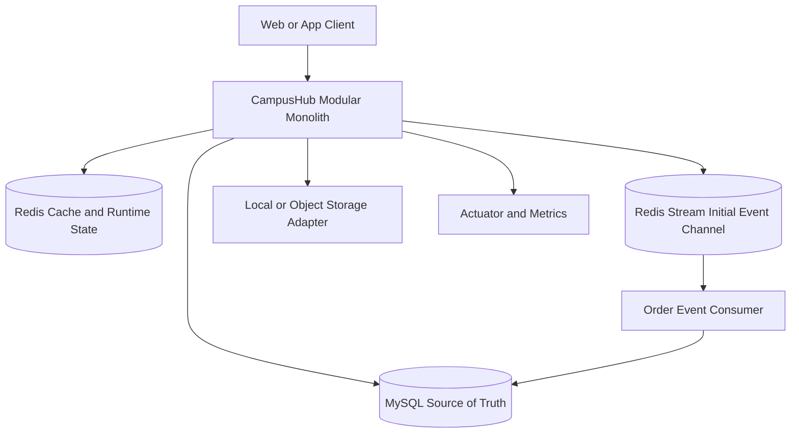
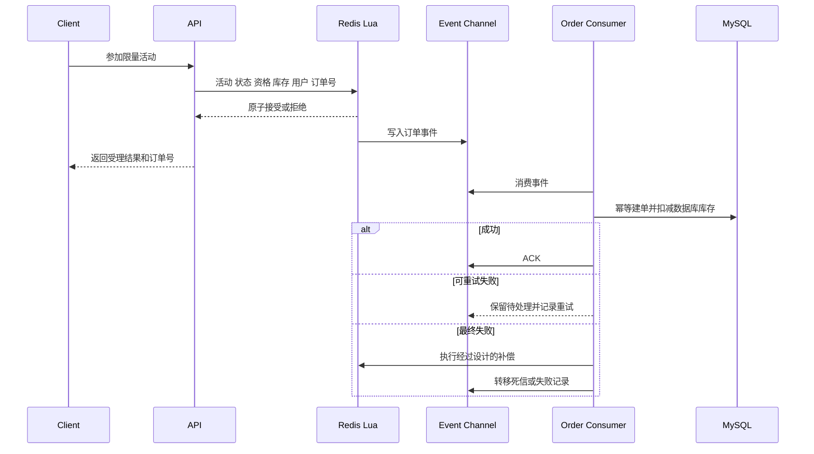

# CampusHub 目标架构

## 1 架构决策

CampusHub 的当前目标是可运行、可测试、可解释的模块化单体，而不是微服务。它面向高校学生、校园周边商户和平台管理员，优先完成身份权限、商户内容、校园动态、优惠活动与限量抢购的闭环。

第一阶段目标技术边界：

- 单体 Spring Boot 应用
- MySQL 作为业务事实来源
- Redis 用于登录状态、缓存、GEO、Feed、签到和活动预扣
- Redis Stream 暂时承载异步订单事件，先验证可靠性，再决定是否迁移 RabbitMQ 或 RocketMQ
- 不在没有搜索需求和同步方案前引入 Elasticsearch
- 不在没有实测前声明性能数据

## 2 模块边界

代码最终按业务模块组织，每个模块内部再区分接口、应用服务、领域规则和基础设施。迁移期间允许旧包与新包共存，禁止一次性移动全部类。

```text
com.campushub
├── identity       用户、认证、角色、会话和账号状态
├── merchant       商户主体、门店、分类和商户成员权限
├── content        校园动态、评论和点赞
├── social         关注关系和 Feed
├── promotion      优惠活动、限量活动和资格规则
├── order          订单、幂等、核销和补偿
├── engagement     签到与活跃体系
└── shared         API 响应、错误码、日志、配置和通用基础设施
```

模块依赖原则：

- Controller 只负责协议转换、校验和鉴权结果接收。
- 应用服务编排事务和模块用例，不直接暴露 MyBatis-Plus 通用 Service 给 Controller。
- Entity 只映射持久化数据；Request 和 Response 只在确有边界差异时创建。
- Redis、消息、文件和搜索实现放在基础设施边界，业务代码依赖接口或清晰的适配器。
- 跨模块写操作通过应用服务完成；事件机制仅在确有异步或解耦收益时引入。

## 3 目标业务模型

### 3.1 身份与权限

- `User`：学生或普通平台用户，拥有账号状态和角色集合。
- `Merchant`：商户主体，代表经营方，不等同于门店。
- `Store`：可搜索和展示的校园周边门店，归属于 Merchant。
- 角色：`USER`、`MERCHANT`、`ADMIN`。
- 商户写操作必须校验“角色 + 资源归属”；管理员操作必须独立授权。

现有 `tb_shop` 在迁移初期继续作为 Store 使用。只有当商户后台真正需要一个商户管理多个门店时，才新增 Merchant 及归属表。

### 3.2 内容与社交

- `Post`：由现有 Blog 演进，表达校园动态或门店内容。
- `Comment`：评论和回复关系。
- `Follow`：用户关注关系，数据库保存事实，Redis 只做加速。
- `Feed`：按用户收件箱组织的时间线，不作为业务事实唯一来源。

### 3.3 优惠活动与订单

- `Promotion`：普通优惠或活动规则。
- `FlashSale`：限量活动的库存、时间、资格和 Redis 运行态。
- `Order`：用户参加活动后的业务结果，数据库唯一约束负责最终幂等。

订单一致性不承诺“绝对一致”。目标是：Redis 原子预扣、可靠事件处理、数据库幂等、失败可重试、异常可补偿、状态可观察。

## 4 目标运行架构



### 4.1 认证目标

Phase 2 决定采用以下一种实现，不同时叠加两套复杂机制：

- 推荐起点：Spring Security + Redis 中的短期访问会话和可撤销 refresh/session 记录。
- JWT 只有在需要无状态跨服务验证时才引入；如果仍是单体且依赖 Redis 主动失效，opaque token 更简单。

无论选择哪一种，都必须支持登出、账号禁用、角色授权、资源归属校验、token 失效和敏感日志治理。

### 4.2 缓存目标

- 使用 Cache Aside。
- 更新数据库成功后删除缓存，删除动作应在事务提交后执行或有失败补偿。
- 热点门店可使用互斥重建或逻辑过期，但同一资源只保留一条正式路径。
- 冷缓存必须可以回源，逻辑过期缓存必须保存统一封装结构。
- key、TTL、空值策略和监控指标集中定义。

### 4.3 限量活动目标



数据库必须有 `(user_id, promotion_id)` 或等价业务键唯一约束。锁可以减少并发冲突，但不能替代该约束。

## 5 数据演进原则

- 使用版本化迁移脚本，不再反复编辑一份不可追踪的全量 SQL。
- 先加字段、索引和兼容读写，再迁移数据，最后删除旧字段或旧表。
- 公开样例数据与表结构分离，并记录数据来源和用途。
- 不机械把所有 Shop 改名为 Store；只有业务边界确定后才迁移代码和数据库名称。

优先数据库变更：

1. 为订单增加用户与活动组合唯一约束。
2. 为关注关系增加用户与被关注用户组合唯一约束。
3. 为 Feed、动态、订单常用查询补充经过执行计划验证的索引。
4. 为用户增加角色和账号状态，或建立规范化角色关系表；选择由 Phase 1 领域模型决定。

## 6 工程目标

- 支持明确的 JDK 和 Maven 版本，提供 Maven Wrapper。
- 提供 dev/test/prod 配置边界和 `.env.example`，仓库不保存真实凭据。
- 测试不依赖开发者电脑已有的 MySQL、Redis 数据或手工创建的 Stream group。
- 每个阶段至少通过编译、相关测试、`git diff --check` 和提交后复审。
- 重要设计写入 `docs/learning/`，记录替代方案、权衡和验证方式。
- README 只声明已经实现并验证的能力；未完成项明确标注。

## 7 暂缓决策

以下内容不在 Phase 0 预设答案：

- RabbitMQ 或 RocketMQ：先把当前 Redis Stream 语义修正确认需求，再做 ADR。
- Elasticsearch：先完成校园商户搜索需求、数据同步和重建方案，再决定引入。
- Spring Boot 3 / Java 17：方向合理，但应在构建可复现、核心测试存在后单独升级，避免把框架迁移与业务重构混在一个提交。
- Docker 化应用：Phase 5 先编排依赖；应用容器化依据本地开发体验决定。
